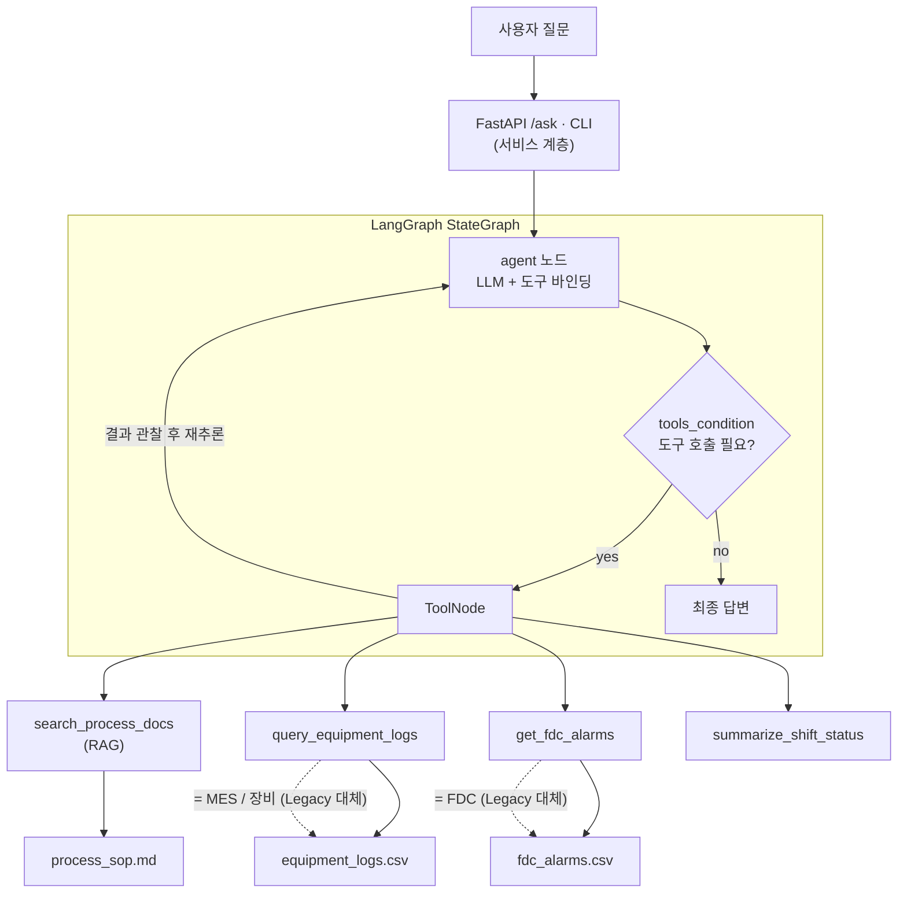
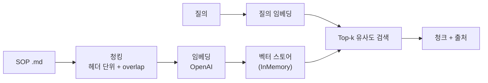
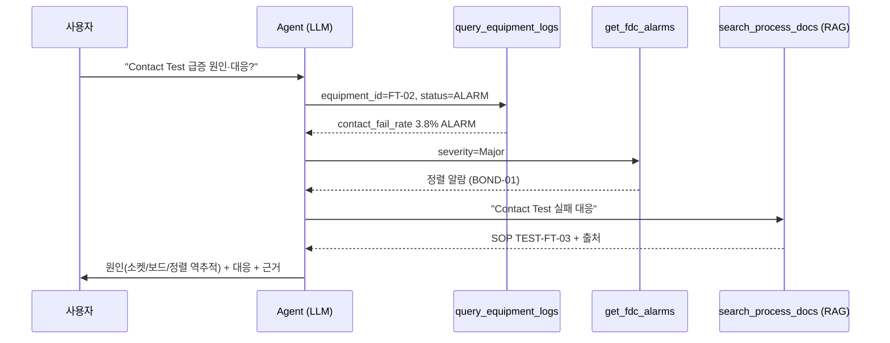

# 제조 현장 지원 AI Agent

[English](README.md) | **한국어**

> 반도체 후공정(P&T) 현장 업무를 지원하는 AI Agent 데모입니다. 공정 지식 검색(RAG), 설비 로그·FDC 알람 조회, 교대 현황 리포트를 **LangGraph**로 오케스트레이션하고 **FastAPI**로 서비스화했습니다.

> ⚠️ 본 레포의 데이터는 전부 **가상**이며 특정 회사 자료가 아닙니다.

`LangGraph` · `RAG` · `FastAPI` · `OpenAI` · `ReAct Agent`

---

## 1. 무엇을 하는가

자연어로 질문하면, Agent가 어떤 도구를 쓸지 스스로 정하고 결과를 읽어 **근거(출처)와 함께** 답합니다.

| 질문 | Agent 동작 |
|---|---|
| "HBM 적층 정렬 오차 기준?" | `search_process_docs` (RAG) → 기준 + 출처 |
| "BOND-01 이상 있어?" | `query_equipment_logs` |
| "Critical 알람만 보여줘" | `get_fdc_alarms` |
| "Contact Test 급증 원인·대응?" | RAG + 로그 + 알람 **교차 분석** |
| "교대 현황 요약" | `summarize_shift_status` → 리포트 |

---

## 2. 아키텍처



데이터·도구 계층(CSV·문서)은 실제 MES/FDC/장비 API를 대체합니다. **도구 인터페이스를 동일하게 유지**했기 때문에, 가상 소스를 실제 시스템으로 교체해도 Agent는 그대로 동작합니다.

### RAG 파이프라인



### 멀티툴 추론 (실제 실행 기반)



---

## 3. 실제 실행 결과 (gpt-4o-mini)

`python demo_cli.py --scenario`로 5개 시나리오 모두 검증. 하이라이트는 하나의 원인분석 질문이 **도구 3개 연쇄 호출 + 교차추론**을 유발한 것.

```text
[질문] FT-02에서 Contact Test 실패율이 급증했는데 원인이 뭐고 어떻게 대응해야 해?
[Agent 도구 호출]
  - query_equipment_logs({'equipment_id': 'FT-02', 'status': 'ALARM'})
  - get_fdc_alarms({'severity': 'Major'})
  - search_process_docs({'query': 'Contact Test 실패 대응'})
[답변] (요약)
  1) 핸들러 소켓 접촉 불량  2) 보드 오염  3) 적층 본딩 정렬 문제 역추적
  → 대응: 소켓·보드 점검, PKG-HBM-01 정렬 역추적, FDC 알람 모니터링
  (근거: process_sop.md + 장비 로그/알람 데이터)
```

```text
[질문] HBM TSV 적층 본딩에서 정렬 오차 허용 기준이 얼마야?
[답변] ±3 µm 이내. 초과 시 TSV 접합 불량 발생.
       (출처: process_sop.md / 1. HBM TSV 적층 본딩 공정 (PKG-HBM-01))
```

### Swagger UI
<!-- 스크린샷을 docs/swagger.png 로 저장하면 아래 줄이 이미지로 렌더링됩니다 -->


> `http://127.0.0.1:8000/docs` 화면을 `docs/swagger.png`로 저장하면 위에 표시됩니다.

---

## 4. 실행 방법

```bash
cd manufacturing_ai_agent
python -m venv .venv && .venv\Scripts\activate   # Windows  (mac/linux: source .venv/bin/activate)
pip install -r requirements.txt

cp .env.example .env        # .env에 OPENAI_API_KEY 입력

python demo_cli.py --scenario            # (A) 5개 시나리오
python demo_cli.py                       # (B) 대화형
python -m uvicorn app.main:app --reload  # (C) API + Swagger → http://127.0.0.1:8000/docs
```

---

## 5. 역량 → 구현 매핑

| 역량 | 구현 |
|---|---|
| LLM Agent 아키텍처 + 백엔드 | LangGraph StateGraph + FastAPI |
| LangGraph 기반 자동화 | `app/graph.py` (ReAct 루프) |
| RAG 시스템 | `app/rag.py` (청킹·임베딩·검색·인용) |
| Legacy(MES/FDC) 연동 | `app/tools.py` (도구 인터페이스) |
| 현장 활용 서비스화 | FastAPI `/ask` + Swagger UI |
| 멀티스텝 의사결정 지원 | 도구 교차 원인분석 |
| 환각 억제 | 출처 인용, `temperature=0`, `recursion_limit` |

---

## 6. 설계 의사결정

- **왜 LangGraph인가 (단순 체인이 아니라)?** 현장 의사결정은 분기·재시도·사람 승인이 필요해 상태 그래프가 적합합니다.
- **왜 출처를 강제하나?** 제조 현장은 오답 비용이 커서, 근거 제시로 작업자가 검증할 수 있게 합니다.
- **검증 사고.** 임베디드 SW(정적분석·회귀검증) 경험을 전이해, 출력 스키마 검증·정답셋 회귀로 Agent 품질을 관리합니다.

## 7. 향후 확장
- 벡터 스토어 → pgvector / Milvus (운영)
- 하이브리드 검색(BM25 + 벡터) + 리랭킹
- Multi-agent(이상탐지 / 원인분석 / 조치추천) + supervisor
- Human-in-the-loop 승인 노드, LLM-as-judge 평가, 비용 모니터링

---

## 프로젝트 구조
```
app/
  config.py   # 환경설정
  rag.py      # RAG 파이프라인
  tools.py    # Agent 도구 (RAG + 로그 + 알람 + 리포트)
  graph.py    # LangGraph ReAct Agent  ★핵심
  main.py     # FastAPI 서비스
data/          # 가상 SOP / 로그 / 알람
demo_cli.py    # CLI 러너
docs/          # 스크린샷
```
