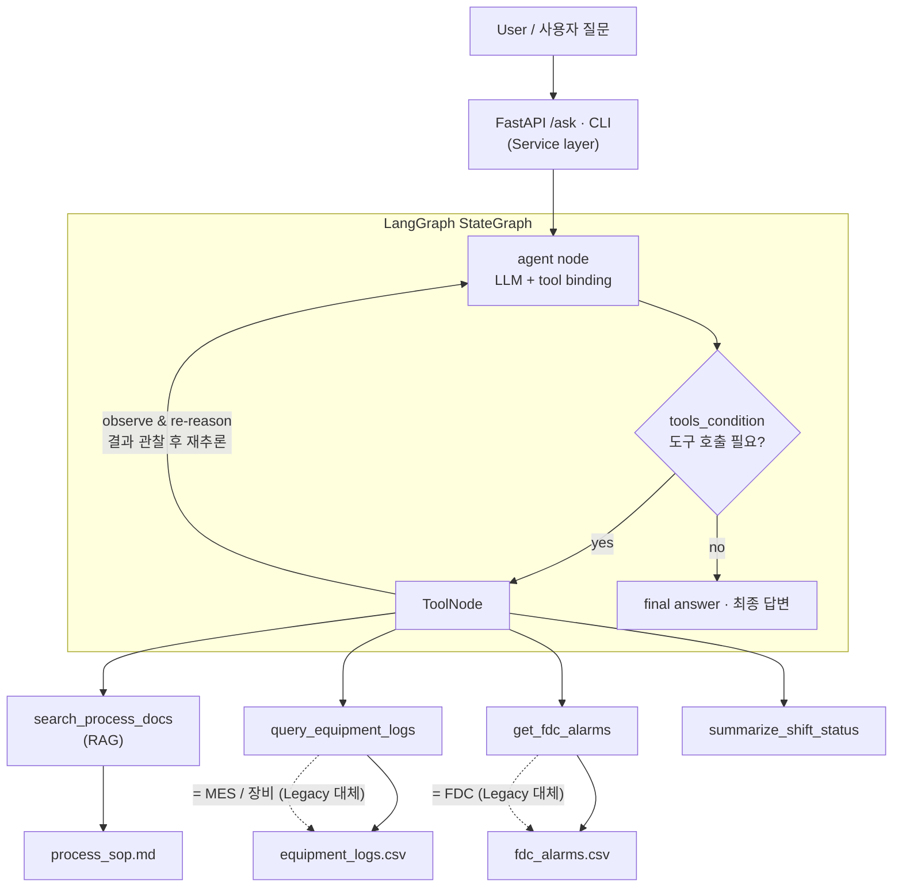
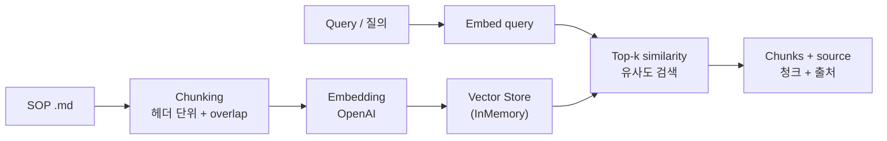
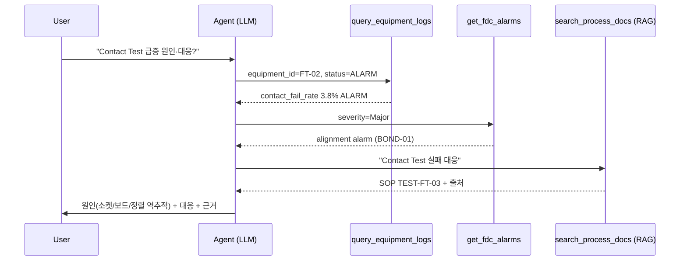

# Manufacturing AI Agent · 제조 현장 지원 AI Agent

> **EN** — A working demo of an AI agent that supports semiconductor back-end (P&T) shop-floor work: it searches process knowledge (RAG), checks equipment logs / FDC alarms, and generates shift reports — orchestrated with **LangGraph** and served via **FastAPI**.
>
> **KO** — 반도체 후공정(P&T) 현장 업무를 지원하는 AI Agent 데모입니다. 공정 지식 검색(RAG), 설비 로그·FDC 알람 조회, 교대 현황 리포트를 **LangGraph**로 오케스트레이션하고 **FastAPI**로 서비스화했습니다.

> ⚠️ All data in this repo is **synthetic** and not from any real company. / 본 레포의 데이터는 전부 **가상**이며 특정 회사 자료가 아닙니다.

`LangGraph` · `RAG` · `FastAPI` · `OpenAI` · `ReAct Agent`

---

## 1. What it does / 무엇을 하는가

**EN** — You ask in natural language; the agent decides which tools to call, reads the results, and answers **with cited sources**.

**KO** — 자연어로 질문하면, Agent가 어떤 도구를 쓸지 스스로 정하고 결과를 읽어 **근거(출처)와 함께** 답합니다.

| Question / 질문 | Agent behavior / 동작 |
|---|---|
| "HBM alignment tolerance?" / "HBM 적층 정렬 오차 기준?" | `search_process_docs` (RAG) → spec + source |
| "Any issue on BOND-01?" / "BOND-01 이상 있어?" | `query_equipment_logs` |
| "Show Critical alarms" / "Critical 알람만" | `get_fdc_alarms` |
| "Contact Test failure — cause & action?" / "Contact Test 급증 원인·대응?" | RAG + logs + alarms **cross-analysis** |
| "Summarize this shift" / "교대 현황 요약" | `summarize_shift_status` → report |

---

## 2. Architecture / 아키텍처



**EN** — Data/tool layers (CSV, `.md`) stand in for real MES/FDC/equipment APIs. Because the **tool interface is kept identical**, swapping the synthetic source for a real system requires no change to the agent.

**KO** — 데이터·도구 계층(CSV·문서)은 실제 MES/FDC/장비 API를 대체합니다. **도구 인터페이스를 동일하게 유지**했기 때문에, 가상 소스를 실제 시스템으로 교체해도 Agent는 그대로 동작합니다.

### RAG pipeline / RAG 파이프라인



### Multi-tool reasoning (real run) / 멀티툴 추론 (실제 실행)



---

## 3. Live run result / 실제 실행 결과 (gpt-4o-mini)

**EN** — All 5 scenarios verified with `python demo_cli.py --scenario`. Highlight: a single causal-analysis question triggers **three chained tool calls** and cross-reasoning.

**KO** — `python demo_cli.py --scenario`로 5개 시나리오 모두 검증. 하이라이트는 하나의 원인분석 질문이 **도구 3개 연쇄 호출 + 교차추론**을 유발한 것.

```text
[질문] FT-02에서 Contact Test 실패율이 급증했는데 원인이 뭐고 어떻게 대응해야 해?
[Agent 도구 호출]
  - query_equipment_logs({'equipment_id': 'FT-02', 'status': 'ALARM'})
  - get_fdc_alarms({'severity': 'Major'})
  - search_process_docs({'query': 'Contact Test 실패 대응'})
[답변] (요약)
  1) 핸들러 소켓 접촉 불량  2) 보드 오염  3) 적층 본딩 정렬 문제 역추적
  → 대응: 소켓·보드 점검, PKG-HBM-01 정렬 역추적, FDC 알람 모니터링
  (근거: process_sop.md + 장비 로그/알람 데이터)
```

```text
[질문] HBM TSV 적층 본딩에서 정렬 오차 허용 기준이 얼마야?
[답변] ±3 µm 이내. 초과 시 TSV 접합 불량 발생.
       (출처: process_sop.md / 1. HBM TSV 적층 본딩 공정 (PKG-HBM-01))
```

### Swagger UI / API 화면
<!-- 스크린샷을 docs/swagger.png 로 저장하면 아래 줄이 이미지로 렌더링됩니다 -->


> EN: Save a screenshot of `http://127.0.0.1:8000/docs` to `docs/swagger.png`. / KO: `http://127.0.0.1:8000/docs` 화면을 `docs/swagger.png`로 저장하면 위에 표시됩니다.

---

## 4. How to run / 실행 방법

```bash
cd manufacturing_ai_agent
python -m venv .venv && .venv\Scripts\activate   # Windows  (mac/linux: source .venv/bin/activate)
pip install -r requirements.txt

cp .env.example .env        # then put your OPENAI_API_KEY in .env / .env에 키 입력

python demo_cli.py --scenario          # (A) 5 scenarios / 5개 시나리오
python demo_cli.py                     # (B) interactive / 대화형
python -m uvicorn app.main:app --reload  # (C) API + Swagger → http://127.0.0.1:8000/docs
```

---

## 5. JD requirement → implementation / 요구사항 → 구현 매핑

| Requirement / 요구사항 | Implementation / 구현 |
|---|---|
| LLM agent architecture + backend / Agent 아키텍처+백엔드 | LangGraph StateGraph + FastAPI |
| LangGraph-based automation / LangGraph 기반 자동화 | `app/graph.py` (ReAct loop) |
| RAG system / RAG 시스템 | `app/rag.py` (chunk·embed·retrieve·cite) |
| Legacy (MES/FDC) integration / Legacy 연동 | `app/tools.py` (tool interface) |
| Service for field use / 현장 서비스화 | FastAPI `/ask` + Swagger UI |
| Multi-step decision support / 멀티스텝 의사결정 | cross-tool causal analysis |
| Hallucination control / 환각 억제 | source citation, `temperature=0`, `recursion_limit` |

---

## 6. Design decisions / 설계 의사결정

- **Why LangGraph (not plain chain)? / 왜 LangGraph?** — Shop-floor decisions need branching, retries, and human approval; a state graph models these explicitly. / 현장 의사결정은 분기·재시도·사람 승인이 필요해 상태 그래프가 적합.
- **Why force citations? / 왜 출처 강제?** — Wrong answers are costly in manufacturing; grounding + citation lets operators verify. / 오답 비용이 큰 제조 현장에서 근거 제시로 검증 가능하게.
- **Verification mindset / 검증 사고** — From embedded SW (static analysis, regression): output-schema validation + regression sets for agent quality. / 임베디드 정적분석·회귀검증 사고를 Agent 품질관리에 전이.

## 7. Roadmap / 향후 확장
- Vector store → pgvector / Milvus (production)
- Hybrid search (BM25 + vector) + re-ranking
- Multi-agent (anomaly / root-cause / action) with supervisor
- Human-in-the-loop approval node, LLM-as-judge evaluation, cost monitoring

---

## Project layout / 구조
```
app/
  config.py   # env/config
  rag.py      # RAG pipeline
  tools.py    # agent tools (RAG + logs + alarms + report)
  graph.py    # LangGraph ReAct agent  ★core
  main.py     # FastAPI service
data/          # synthetic SOP / logs / alarms
demo_cli.py    # CLI runner
docs/          # screenshots
```
