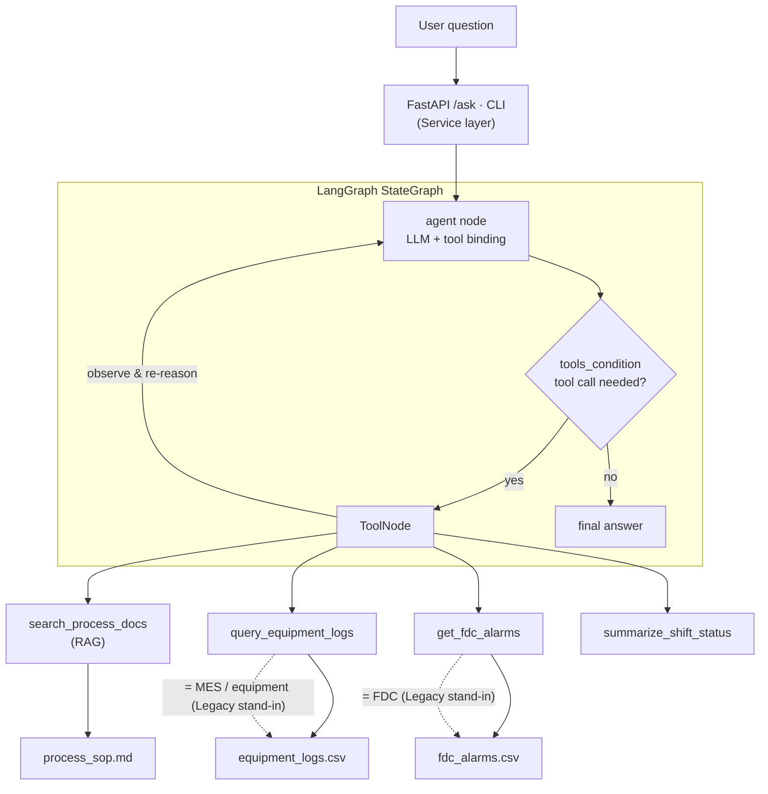
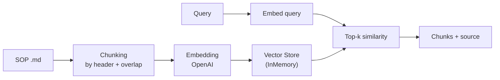
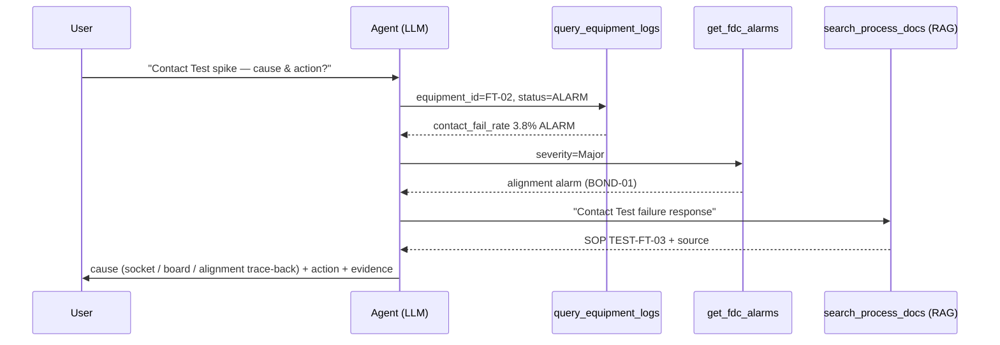

# Manufacturing AI Agent

**English** | [한국어](README-ko.md)

> A working demo of an AI agent that supports semiconductor back-end (P&T) shop-floor work: it searches process knowledge (RAG), checks equipment logs / FDC alarms, and generates shift reports — orchestrated with **LangGraph** and served via **FastAPI**.

> ⚠️ All data in this repo is **synthetic** and not from any real company.

`LangGraph` · `RAG` · `FastAPI` · `OpenAI` · `ReAct Agent`

---

## 1. What it does

You ask in natural language; the agent decides which tools to call, reads the results, and answers **with cited sources**.

| Question | Agent behavior |
|---|---|
| "HBM stacking alignment tolerance?" | `search_process_docs` (RAG) → spec + source |
| "Any issue on BOND-01?" | `query_equipment_logs` |
| "Show Critical alarms only" | `get_fdc_alarms` |
| "Contact Test failure spiked — cause & action?" | RAG + logs + alarms **cross-analysis** |
| "Summarize this shift" | `summarize_shift_status` → report |

---

## 2. Architecture



Data/tool layers (CSV, `.md`) stand in for real MES/FDC/equipment APIs. Because the **tool interface is kept identical**, swapping the synthetic source for a real system requires no change to the agent.

### RAG pipeline



### Multi-tool reasoning (from a real run)



---

## 3. Live run result (gpt-4o-mini)

All 5 scenarios verified with `python demo_cli.py --scenario`. Highlight: a single causal-analysis question triggers **three chained tool calls** and cross-reasoning.

```text
[Q] Contact Test failure rate spiked on FT-02 — what's the cause and how to respond?
[Agent tool calls]
  - query_equipment_logs({'equipment_id': 'FT-02', 'status': 'ALARM'})
  - get_fdc_alarms({'severity': 'Major'})
  - search_process_docs({'query': 'Contact Test failure response'})
[Answer] (summary)
  1) handler socket contact failure  2) board contamination  3) trace back stacking alignment
  -> action: inspect socket/board, trace back PKG-HBM-01 alignment, monitor FDC alarms
  (evidence: process_sop.md + equipment log / alarm data)
```

```text
[Q] What's the alignment-error tolerance for HBM TSV stacking?
[Answer] Within ±3 µm. Exceeding it causes TSV bonding defects.
         (source: process_sop.md / 1. HBM TSV stacking process (PKG-HBM-01))
```

### Swagger UI
<!-- Save a screenshot to docs/swagger.png and the line below renders as an image -->


> Save a screenshot of `http://127.0.0.1:8000/docs` to `docs/swagger.png`.

---

## 4. How to run

```bash
cd manufacturing_ai_agent
python -m venv .venv && .venv\Scripts\activate   # Windows  (mac/linux: source .venv/bin/activate)
pip install -r requirements.txt

cp .env.example .env        # then put your OPENAI_API_KEY in .env

python demo_cli.py --scenario            # (A) 5 scenarios
python demo_cli.py                       # (B) interactive
python -m uvicorn app.main:app --reload  # (C) API + Swagger -> http://127.0.0.1:8000/docs
```

---

## 5. Capability → implementation mapping

| Capability | Implementation |
|---|---|
| LLM agent architecture + backend | LangGraph StateGraph + FastAPI |
| LangGraph-based automation | `app/graph.py` (ReAct loop) |
| RAG system | `app/rag.py` (chunk · embed · retrieve · cite) |
| Legacy (MES/FDC) integration | `app/tools.py` (tool interface) |
| Service for field use | FastAPI `/ask` + Swagger UI |
| Multi-step decision support | cross-tool causal analysis |
| Hallucination control | source citation, `temperature=0`, `recursion_limit` |

---

## 6. Design decisions

- **Why LangGraph (not a plain chain)?** Shop-floor decisions need branching, retries, and human approval; a state graph models these explicitly.
- **Why force citations?** Wrong answers are costly in manufacturing; grounding + citation lets operators verify.
- **Verification mindset.** Carried over from embedded SW (static analysis, regression): output-schema validation + regression sets for agent quality.

## 7. Roadmap
- Vector store → pgvector / Milvus (production)
- Hybrid search (BM25 + vector) + re-ranking
- Multi-agent (anomaly / root-cause / action) with a supervisor
- Human-in-the-loop approval node, LLM-as-judge evaluation, cost monitoring

---

## Project layout
```
app/
  config.py   # env/config
  rag.py      # RAG pipeline
  tools.py    # agent tools (RAG + logs + alarms + report)
  graph.py    # LangGraph ReAct agent  *core
  main.py     # FastAPI service
data/          # synthetic SOP / logs / alarms
demo_cli.py    # CLI runner
docs/          # screenshots
```
